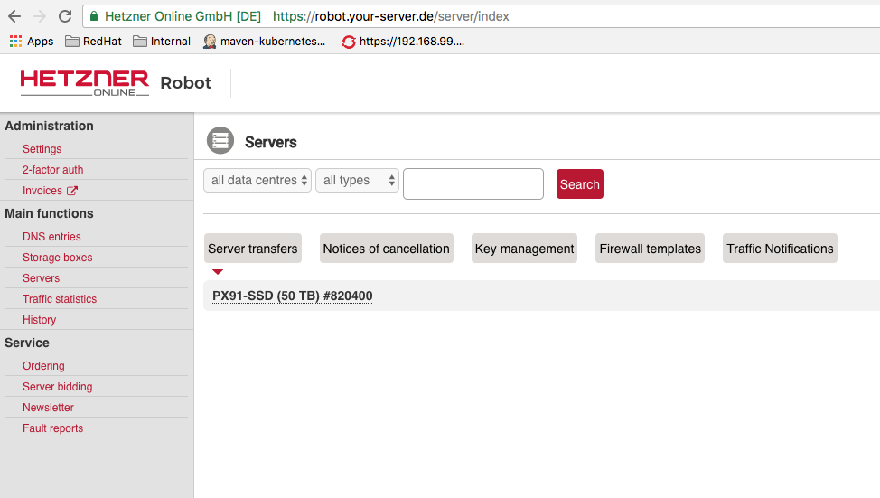

## OS Installation on Hetzner Cloud Machine

You first need to login to Hetzner robot
at https://robot.your-server.de/server and then select your machine by clicking on its the server link

E.g : `PX91-SSD (50 TB) #820400`

 

### Install CentOS 7.4 Minimal

Next, we will install the CentOS 7 OS which is proposed by Hetzner Cloud Platform.

* Select CentOS 7.4 in Linux tab and accept initiate installation. Take care to note the root password supplied.


* Initiate a reset from the Reset tab.


* Wait a few minutes for the installation to complete

### Copy ssh key to machine

You need to perform `ssh-copy-id root@ipaddress` in order to later perform password-less login
The root password is supplied via email when the Hetzner machine is initially created

E.g

```bash
sshpass -f pwd.txt ssh -o StrictHostKeyChecking=no root@195.201.87.126 "mkdir ~/.ssh && chmod 700 ~/.ssh && touch ~/.ssh/authorized_keys && chmod 600 ~/.ssh/authorized_keys"
sshpass -f pwd.txt ssh-copy-id -o StrictHostKeyChecking=no -i ~/.ssh/id_rsa.pub root@195.201.87.126
```

### Prerequisites

In order to install OpenShift using the `openshift-ansible` playbook, it is mandatory to install the NetworkManager Package 

```bash
yum install -y NetworkManager
systemctl enable NetworkManager
systemctl start NetworkManager
```

## Install OpenShift

Follow the instructions in `../ansible/README-cloud.md`
